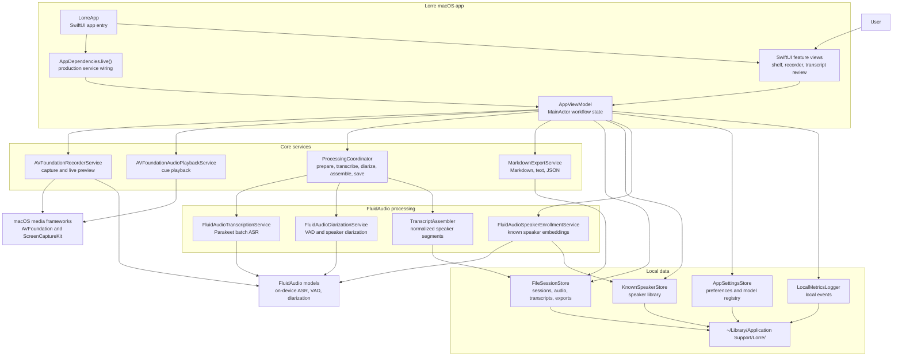

# Lorre

Lorre is a macOS transcription workspace for capturing or importing audio, processing it locally, reviewing speaker-labeled transcript segments, and exporting the result in multiple formats.

## Key features

- Capture any conversation your way with `Microphone`, `System audio`, or `Microphone + system audio`.
- See live transcription as you record, with selectable `Parakeet EOU` or `Nemotron` streaming previews for supported live workflows.
- Powered by selectable `Parakeet TDT 0.6B v3` multilingual batch ASR and `Parakeet TDT 0.6B v2` for English-only batch transcripts, running on Apple's `Neural Engine` right on your Mac.
- Supports automatic language detection across `25 European languages`, including Dutch, English, German, French, Spanish, and more.
- Built on `FluidAudio` for local speech recognition, voice activity detection, and speaker diarization.
- Keep your recordings and transcripts on your Mac for a private local workflow.
- Enable `Privacy Mode` to automatically delete source audio after the transcript is saved.
- Import existing audio files and run them through the same transcription pipeline.
- Review transcripts with speaker labels, playback, speaker reassignment, and inline text editing.
- Export finished sessions as `Markdown`, `plain text`, or `JSON`.

## What is FluidAudio?

[`FluidAudio`](https://github.com/FluidInference/FluidAudio) is the on-device speech engine behind Lorre. It is a Swift library for Apple devices that combines speech-to-text, voice activity detection, and speaker diarization in one local pipeline.

Lorre defaults to FluidAudio's `Parakeet TDT 0.6B v3` model for final transcription, and English-only workflows can choose `Parakeet TDT 0.6B v2` as a batch option. In simple terms, Parakeet is the ASR model that listens to your recording and turns spoken words into text. The v3 path supports automatic language detection across 25 European languages, while Lorre can use FluidAudio's faster `Parakeet EOU` or `Nemotron` streaming models to show a live preview while you are still recording.

`ANE-optimized` means FluidAudio is tuned to run efficiently on Apple's Neural Engine, the part of Apple silicon designed for AI workloads. For a user, that usually means faster transcription, lower power use, and less pressure on the CPU and GPU.

`Parakeet 0.6B` means the model has about 600 million parameters. That is relatively compact compared with many modern AI models, which helps keep it practical for local use on a Mac without needing the kind of memory larger cloud-style models often expect.

The main benefit of FluidAudio is that it gives Lorre a complete local speech stack:

- your audio can stay on your Mac instead of being sent to a cloud API
- it is built for Apple devices, so it can take advantage of Apple hardware for speed and efficiency
- it handles the hard parts together: detecting speech, transcribing it, and separating speakers

That is what lets Lorre offer private, on-device transcription with speaker labeling in a single app.

## Architecture

Lorre is split into a SwiftUI presentation layer, a `MainActor` app workflow model, protocol-backed core services, FluidAudio processing adapters, and local file-based persistence.



For a recording or import, `AppViewModel` creates a local session, `ProcessingCoordinator` runs model preparation, transcription, optional diarization, and transcript assembly, and `FileSessionStore` persists the finished `transcript.json` beside the session audio and exports.

## Requirements

- macOS 14 or later
- Microphone access for microphone recording
- Screen and System Audio Recording access for system-audio capture
- A local build environment for Swift if you want to run from source

## Build and run

```bash
swift run
```

To build the app bundle in `dist/`:

```bash
./scripts/package_macos_app.sh
```

## Privacy and local data

Lorre stores session data in `~/Library/Application Support/Lorre/`.

Each session is kept in its own folder and can contain:

- `session.json` for session metadata
- `transcript.json` for transcript data
- recorded or imported audio
- optional microphone and system-audio stem files for mixed recordings
- exported transcript files

If privacy mode is enabled before a recording or import, Lorre deletes the source audio after transcription completes and keeps the transcript and exports.

## Export formats

- Markdown
- Plain text
- JSON


<p align="center">
  <a href="https://fluidinference.com">
    
  </a>
</p>
