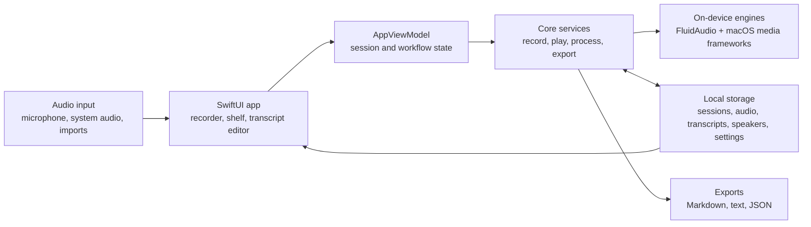

# Lorre

Lorre is a macOS transcription workspace for capturing or importing audio, processing it locally, reviewing speaker-labeled transcript segments, and exporting the result in multiple formats.

## Key features

- Capture any conversation your way with `Microphone`, `System audio`, or `Microphone + system audio`.
- See live transcription as you record, with selectable `Parakeet EOU` or `Nemotron` streaming previews for supported live workflows.
- Powered by selectable `Parakeet TDT 0.6B v3` multilingual batch ASR and `Parakeet TDT 0.6B v2` for English-only batch transcripts, running on Apple's `Neural Engine` right on your Mac.
- Supports multilingual `Parakeet v3` transcription, with explicit batch language hints for `English`, `French`, `German`, `Spanish`, `Italian`, `Portuguese`, `Dutch`, and `Polish`.
- Built on `FluidAudio` for local speech recognition, voice activity detection, and speaker diarization.
- Keep your recordings and transcripts on your Mac for a private local workflow.
- Enable `Privacy Mode` to automatically delete source audio after the transcript is saved.
- Import existing audio files and run them through the same transcription pipeline.
- Review transcripts with speaker labels, playback, speaker reassignment, and inline text editing.
- Export finished sessions as `Markdown`, `plain text`, or `JSON`.

## What is FluidAudio?

[`FluidAudio`](https://github.com/FluidInference/FluidAudio) is the on-device speech engine behind Lorre. It is a Swift library for Apple devices that combines speech-to-text, voice activity detection, and speaker diarization in one local pipeline.

Lorre defaults to FluidAudio's `Parakeet TDT 0.6B v3` model for final transcription, and English-only workflows can choose `Parakeet TDT 0.6B v2` as a batch option. In simple terms, Parakeet is the ASR model that listens to your recording and turns spoken words into text. FluidAudio's v3 model supports 25 European languages; Lorre exposes explicit batch language hints for English, French, German, Spanish, Italian, Portuguese, Dutch, and Polish. Lorre can also use FluidAudio's faster `Parakeet EOU` or `Nemotron` streaming models to show a live preview while you are still recording.

`ANE-optimized` means FluidAudio is tuned to run efficiently on Apple's Neural Engine, the part of Apple silicon designed for AI workloads. For a user, that usually means faster transcription, lower power use, and less pressure on the CPU and GPU.

`Parakeet 0.6B` means the model has about 600 million parameters. That is relatively compact compared with many modern AI models, which helps keep it practical for local use on a Mac without needing the kind of memory larger cloud-style models often expect.

The main benefit of FluidAudio is that it gives Lorre a complete local speech stack:

- your audio can stay on your Mac instead of being sent to a cloud API
- it is built for Apple devices, so it can take advantage of Apple hardware for speed and efficiency
- it handles the hard parts together: detecting speech, transcribing it, and separating speakers

That is what lets Lorre offer private, on-device transcription with speaker labeling in a single app.

## Architecture

At a high level, Lorre routes recording, import, review, and export workflows through a SwiftUI app model, then keeps processing and storage local to the Mac.



All session data lives under `~/Library/Application Support/Lorre/` unless you export it.

## Configuration

Lorre keeps app preferences in `~/Library/Application Support/Lorre/settings.json`. Most settings affect new recordings, imported audio, or retry-processing runs; they do not rewrite an already finished transcript unless you process that session again.

### Recorder options

| Option | Values | Default | Notes |
| --- | --- | --- | --- |
| Capture mode | `Microphone`, `System audio`, `Microphone + system audio` | `Microphone` | System-audio modes require Screen and System Audio Recording permission. When system audio is included, Lorre opens the native macOS picker so you can choose the app, window, or display audio to capture. |
| Live transcript preview | On or off | On when supported | Shows streaming text while recording. The final transcript is still produced by the selected batch transcription mode after recording stops. |
| Live engine | `Parakeet low latency`, `Parakeet balanced`, `Parakeet high accuracy`, `Nemotron balanced`, `Nemotron high accuracy` | `Parakeet balanced` | Controls the streaming preview model and latency/quality balance. Live-engine changes are locked while a recording is active. |
| Retention | `Keep Audio`, `Delete After Transcript` | `Keep Audio` | `Delete After Transcript` is privacy mode: Lorre deletes the source audio after the transcript is saved and keeps transcript data and exports. Playback and waveform review require retained audio. |

### Speech and processing options

| Option | Values | Default | Notes |
| --- | --- | --- | --- |
| ASR mode | `Parakeet v3 multilingual`, `Parakeet v2 English`, `Parakeet + Cohere` | `Parakeet v3 multilingual` | `Parakeet v3 multilingual` is the default timed transcript path. `Parakeet v2 English` is English-only. `Parakeet + Cohere` adds an alternate draft while timed transcript rows still come from Parakeet. |
| Batch language | `EN`, `FR`, `DE`, `ES`, `IT`, `PT`, `NL`, `PL` | `EN` | Changing language away from English automatically falls back from the English-only v2 path to the multilingual v3 path. |
| Speaker recognition | On or off | On | Enables diarization during processing so Lorre can assign speaker labels automatically. Turning it off keeps speakers manual unless you retry processing later. |
| Diarization engine | `Offline VBx`, `Sortformer`, `LS-EEND` | `Offline VBx` | `Offline VBx` favors full-recording offline clustering. `Sortformer` targets stable identity continuity for up to 4 speakers. `LS-EEND` is overlap-friendly and supports up to 10 speakers. |
| Expected speakers | `Auto`, `Exact 1`, `Exact 2`, `Exact 3`, `Exact 4`, `Range 2-4`, `Range 2-6` | `Auto` | Gives the diarizer a speaker-count hint for new processing runs. |
| Known speakers | Local speaker name plus an audio sample | None | Enrolled voices are stored in `known-speakers.json` and `known-speaker-samples/`, then used to relabel diarization clusters and provide live speaker hints when supported. You can add, update, or delete enrolled speakers. |
| Vocabulary boosting | On or off, plus custom terms | Off | Available only when the linked runtime supports it. Terms are stored even in builds where boosting is inactive. Use one term per line, or `Canonical: alias1, alias2` for variants. |
| Show confidence | On or off | Off | Shows confidence percentages under transcript rows when the ASR result includes confidence data. |
| Diarization debug JSON | On or off | Off | Writes `diarization-debug.json` into each processed session folder for troubleshooting speaker-label issues. |
| Model registry | Default Hugging Face registry or a custom base URL | `https://huggingface.co` | Set this before preparing or downloading models if you need a mirror or private registry. Leave blank to use the default. |

The `Prepare Models` action downloads and warms the currently selected local model set. It stores the last-prepared status in `settings.json`, but it is an action rather than a processing preference.

Advanced settings file note: `batchTranscription.parallelChunkConcurrency` defaults to `4` and is normalized to a range of `1` to `8`. The current UI preserves this value but does not expose a control for it.

### Workspace and review options

| Option | Values | Where it is stored |
| --- | --- | --- |
| Session folders | Create, rename, delete, move sessions to a folder or `Unfiled` | Folder definitions live in `settings.json`; each session's folder assignment lives in its `session.json`. Deleting a folder moves its sessions to `Unfiled`. |
| Sidebar expansion | Expanded/collapsed view filters and folders | `settings.json` |
| Session title | Rename any recording | The session's `session.json` |
| Session notes | Add, save, or clear a private note | The session's `session.json` |
| Transcript text | Edit transcript segments inline | The session's `transcript.json` |
| Speaker labels | Reassign a segment or rename a speaker in the transcript | The session's `transcript.json` |
| Playback rate | `0.75x`, `1.0x`, `1.25x`, `1.5x` | Current app session only |
| Export format | `Markdown`, `Plain Text`, `JSON` | Exported files are written to the destination you choose and export history is recorded in `session.json`. |

## Requirements

- macOS 14 or later
- Microphone access for microphone recording
- Screen and System Audio Recording access for system-audio capture
- A local build environment for Swift if you want to run from source

## Build and run

```bash
swift run
```

To build the app bundle in `dist/`:

```bash
./scripts/package_macos_app.sh
```

To run the test suite:

```bash
./scripts/swift_test.sh
```

To run the local CI check used by this repo:

```bash
./scripts/ci_check.sh
```

## Privacy and local data

Lorre stores session data in `~/Library/Application Support/Lorre/`.

Each session is kept in its own folder and can contain:

- `session.json` for session metadata
- `transcript.json` for transcript data
- recorded or imported audio
- optional microphone and system-audio stem files for mixed recordings
- exported transcript files

If privacy mode is enabled before a recording or import, Lorre deletes the source audio after transcription completes and keeps the transcript and exports.

## Export formats

- Markdown
- Plain text
- JSON


<p align="center">
  <a href="https://fluidinference.com">
    
  </a>
</p>
